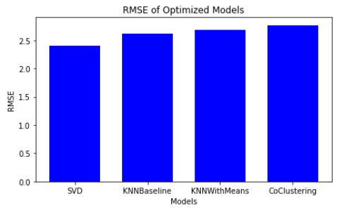

# Creating and Deploying a Song Recommendation System

[song_recommender_app_demo.webm](https://user-images.githubusercontent.com/108199202/194585900-89e964ff-988a-4be5-90a2-6b7604e14449.webm)

## Project Overview:
Using the CRISP-DM model, I created and deployed a music recommendation system. By quering open-source, unrated `listens` from [ListenBrainz](https://listenbrainz.org/) through Google BigQuery, I was able to work with 37 million rows on Google Colab. I transformed the frequency of plays per profile per song to create an explicit rating system. Then I was able to create and deploy a lightweight collaborative SVD model for people to find new music. Users would simply need to pick the artist, song, and rating for several songs of their choice to get personalized recommmendations for their tastes.

## Business Problem:

There is a lot of money in streaming services. In the US alone there are more than 82M subscribers to music streaming services, with an average user listening to 75 minutes of music every day. Although most users have a core set of songs that they listen to, keeping listeners interested with new music options are critical for these services success. The hard part is finding music that works with every individual, as not everyone listens to the same music. Therefore, a music recommender system is one of the most important aspects for these companies to have working.

On a personal note, I listen to a LOT of music: I've been in Spotify's top 1% of listeners by time for the past two years, according to their end of year 'Wrapped'. I love finding new music to share with my friends, and my friends have a lot of varied tastes so it's important to me to be able to accomidate all of their tastes. I was hoping to create a tool to help me do just that.

## Data Understanding and Preparation:
All data was sourced from [ListenBrainz](https://listenbrainz.org/) through [Google BigQuery](https://console.cloud.google.com/marketplace/product/metabrainz/listenbrainz?project=listenbrainzrecommender). Here are a couple of key things to know about this data:
1. This data is open-source and is volunteered by users.
2. Every row is a `listen`, where the user has listened to at least half of a song.
3. Every `listen` contains 12 columns. Besides the `listened_at` and `user_name`, all other fields contain music specifying the song listened to, such as `artist_name` and `track_name`.
4. There are 149 million rows to query from the years 2005 to 2018: I was only able to use 37 million rows from 2016-2018 due to computational limits.
5. There are no ratings contained in a `listen`.

If we look at the frequency that users listen to a song, 51% of the time a user will only listen to a song a single time. It doesn't make sense to recommend a song that you've listened to once. Using this approach, I was able to create an explicit rating for every user for every song they a `listen`s for, from 1-10. I called these rated transformations `plays`.

## Modeling and Evaluation:
I primarily used [Surprise](https://surprise.readthedocs.io/en/stable/index.html) to create recommender models. Through usage of grid-search cross-validation(GSCV) on many different models, I was able to find that the best recommendation model was an SVD model. I used RMSE and MAE as optimization factors, where to get these metrics I would insert unseen data after training the model to see what the difference was between the actual and predicted values. However, there are a couple of important things to note for this modeling process:
1. Models were GSCV with a subset of the main dataset.
2. The best model was an SVD model.
3. An SVD model with the top 1 million songs was 1.3 Gb.
4. I made a lightweight SVD model with the top 10 thousand songs for deployment.
5. The lightweight model had a final RMSE of 2.42.

## Deployment:
For deployment, I created a Streamlit app that uses the lightweight SVD model. You can find the app [here](https://mitchallison2-song-recommender-streamlitapp-tnfjie.streamlitapp.com/).There is a video of it functioning at the start of this README, but I will walk you through the process of how it works.
1. User picks an artist and song. There are only songs from the top 10 thousand songs available.
2. User pick a rating for that song.
3. User adds this song to a list, creating a list of songs tied to their profile. These songs remain in the list when the user closes the browser.
4. User hits the `RECOMMEND SONGS` button.
5. The app recomputes the SVD matrix, including this new user and their song ratings.
6. The app returns the top 10 recommended songs, sorted by how much the model thinks they will like the song.
7. Users can clear their list to try adding different combinations of songs to see what the model recommends.
